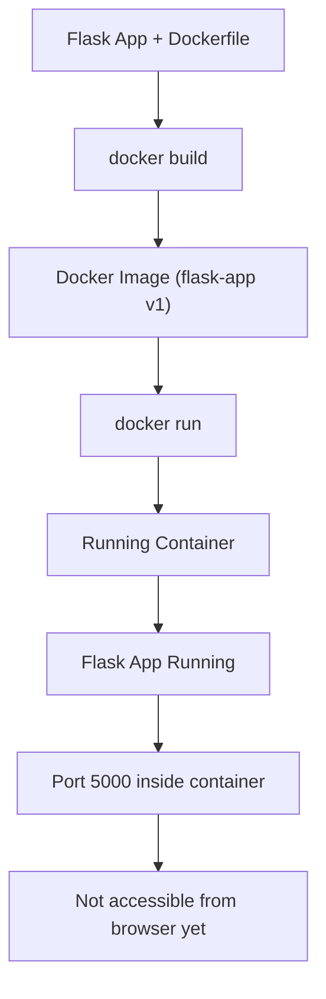

# 02 - First Dockerfile

## 1. What Problem It Solves

In Step 1, we ran a Flask application locally.

That approach has serious limitations:

- Different environments (OS, Python versions)
- Dependency conflicts
- Manual setup steps
- “It works on my machine” problem

This step introduces a **Dockerfile**, which solves this by:

- Defining environment in code
- Packaging app + dependencies together
- Ensuring consistent execution anywhere
- Removing dependency on local machine setup

This is the foundation of **containerization**.


## 2. Core Concepts

### What is a Docker Image?

A Docker Image is:

> A read-only filesystem snapshot + metadata

It contains:

- Base OS layer
- Runtime (Python, Node, etc.)
- Dependencies
- Application code
- Startup command

Think of it like an **AWS AMI**, but for applications.


### What is a Docker Container?

A Container is:

> A running instance of an image

Technically:

- A process running in isolation
- Uses image layers
- Adds a writable layer on top


### How Docker Works (Simplified)

Docker:

1. Reads the Dockerfile
2. Executes instructions step-by-step
3. Creates layers for each step
4. Produces a final image

That image is then used to run containers.


## 3. Dockerfile (Line-by-Line Explanation)

### Base Image

```dockerfile
FROM python:3.11-slim
```

- Defines the base environment
- Pulled from Docker Hub: https://hub.docker.com/
- Maintained by Docker + official language maintainers


### Working Directory
```dockerfile
WORKDIR /app
```

- Sets working directory inside container
- Not mandatory to use /app. Can use /flask, /service etc
- Naming is for readability only

### Copy Requirements
```dockerfile
COPY requirements.txt .
```

- Copies file from host → container
- . refers to current WORKDIR

### Install Dependencies
```dockerfile
RUN pip install --no-cache-dir -r requirements.txt
```

What happens internally:

- Docker creates a temporary container
- Executes the command
- Saves result as a new image layer

### Copy Application Code
```dockerfile
COPY . .
```

- Copies entire project into container
- Source (host folder) → /app inside container

### Expose Port
```dockerfile
EXPOSE 5000
```

Important:

- Does NOT open a port
- Does NOT make app accessible

It only documents:

“This container is expected to use port 5000”

### Default Command
```dockerfile
CMD ["python", "app.py"]
```

- Runs when container starts
- Uses exec form (JSON array)

Why exec form is better:

- No shell wrapper
- Proper signal handling
- Better process management
- Required for production use


## 4. Build the Image
```bash
docker build -t flask-app:v1 .
```
- -t = tag (name:version)

Without -t:

- Image still builds
- Gets random ID → hard to manage


## 5. Where Images Are Stored

Docker stores images internally:
- Linux: /var/lib/docker

You should never manually modify this.
To view images:
```bash
docker images
```

Example output:

```bash
IMAGE           ID              SIZE
flask-app:v1    affaf83c0590    59MB
```

## 6. Run the Container
```bash
docker run flask-app:v1
```

You will notice:
- Container runs
- But app is NOT accessible in browser

### Why?
Docker containers run in an isolated network by default, so they are not accessible from your host machine unless ports are explicitly mapped.
You must explicitly map ports (covered in next step).

## 7. Common Misconceptions
- Dockerfile runs the app → No, it only builds the image
- EXPOSE opens ports → No, it is just documentation
- Image is a running system → No, it is a static snapshot
- WORKDIR must be /app → No, naming is your choice

## 8. Exercises

Try the following:
- Change base image to python:3.10
- Break requirements.txt and observe build failure
- Change WORKDIR and test behavior
- Remove --no-cache-dir and compare image size

## 9. Troubleshooting

### Build Fails
- Check syntax errors in Dockerfile
- Verify requirements.txt exists
- Ensure internet access for dependency download
### App Not Accessible
- Expected behavior (no port mapping yet)
- Will be fixed in next step

## 10. Production Best Practices (Intro Level)
- Use minimal base images (slim, alpine)
- Avoid unnecessary files in image
- Install only required dependencies
- Use exec form in CMD
- Keep image size small

## 11. Key Takeaways
- Dockerfile = blueprint for your application
- Image = packaged application
- Container = running application
- Build once, run anywhere

## Visual Flow

