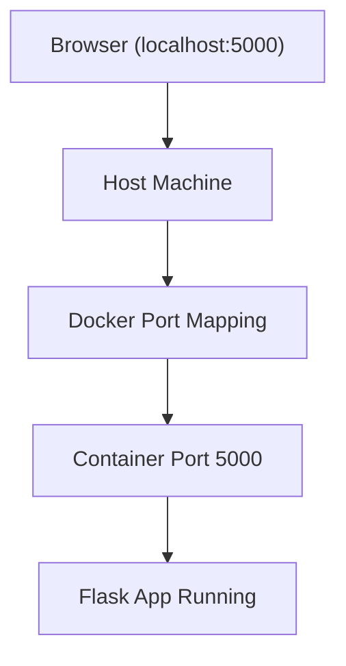

# 03 - Running Containers & Port Mapping

## Goal of This Step

Understand why a running container is not accessible from the browser
and learn how to expose it using port mapping.

## 1. What Problem It Solves

In the previous step, we successfully built a Docker image for our Flask application.

However, building an image is not enough.

We need to:

- Run the application inside a container
- Access it from our browser

At this stage, a common issue appears:

> The container runs, but the application is not accessible.

This step solves that problem by introducing **port mapping**.

## 2. What Happened

I ran the container using:

```bash
docker run flask-app:v1
```
The logs showed:
- Flask is running
- It is listening on port 5000

Something like:
```bash
Running on http://127.0.0.1:5000
Running on http://172.17.0.2:5000
```
At this point, I expected the app to be accessible in the browser. So I opened:

```bash
http://127.0.0.1:5000
```
But it failed with:

This site can’t be reached (ERR_CONNECTION_REFUSED)

This was confusing because the application was clearly running.

## 3. Why It Happens

The key thing to understand:
> Docker containers run in an isolated network.

Even though Flask is running on port 5000, it is running inside the container, not on my machine.

So:
- 127.0.0.1:5000 inside container ≠ 127.0.0.1:5000 on my system
The container has its own:
- IP address (e.g., 172.17.0.2)
- Network namespace

My browser cannot directly access that internal network.

## 4. Solution: Port Mapping

To make the application accessible, I used:

```bash
docker run -p 5000:5000 flask-app:v1
```
This means:
```bash
<host_port>:<container_port>
```

So:

Host (my system) port 5000
→ Container port 5000

Now when I open:
```bash
http://localhost:5000
```

The request reaches the container successfully.

## 5. Deep Understanding

What -p 5000:5000 really does

Docker creates a network rule:

> Forward traffic from host:5000 → container:5000

Internally, Docker uses:

- NAT (Network Address Translation)
- iptables (on Linux)

### Important Clarification

Even though logs say:

```bash
Running on http://127.0.0.1:5000
```

This is:

> Inside the container, not your machine

### You can change ports

Example:

```bash
docker run -p 8080:5000 flask-app:v1
```

Now:

- Open http://localhost:8080
- Still connects to container port 5000

### EXPOSE vs Port Mapping

Instruction         	Meaning
EXPOSE 5000	            Documentation only
-p 5000:5000	        Actually opens access

## 6. Commands

Run without port mapping (fails in browser)

```bash
docker run flask-app:v1
```

Run with port mapping (works)

```bash
docker run -p 5000:5000 flask-app:v1
```

## 7. Visual Understanding


## 8. Real-World Notes

- Containers are isolated by design for security
- Port mapping is required for any external access
- In production, this is usually handled by load balancers or reverse proxies

## 9. Exercises

Try the following:

- Run container without -p and confirm failure
- Change mapping:
```bash
docker run -p 8080:5000 flask-app:v1
```
- Open http://localhost:8080
- Try running multiple containers on different ports

## 10. Key Takeaways

- Containers run in isolated networks
- Ports inside container are NOT exposed by default
- -p connects host to container
- Left side = host port
- Right side = container port

