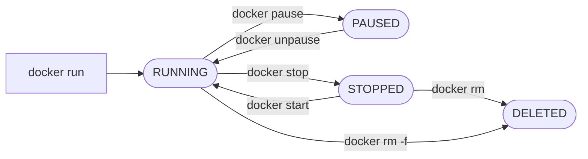

# 04 - Container Lifecycle

## Goal of This Step

Understand how containers are created, run, stopped, paused, and removed, and how Docker manages their lifecycle.


## 1. What Problem It Solves

In the previous step, we learned how to run a container and access it using port mapping.

However, running a container is only part of the process.

We also need to:

- See running containers
- Stop containers
- Restart them
- Remove unused containers
- Understand what happens after a container stops

Without understanding lifecycle, containers can quickly become messy and confusing.

## 2. What Happened

I started by running a container:

```bash
docker run -p 5000:5000 flask-app:v1
```
It worked fine, but the terminal was blocked.

So I stopped it using CTRL + C

Then I checked running containers:

```bash
docker ps
```

Surprisingly, nothing showed up.
But when I ran:

```bash
docker ps -a
```

I saw my container listed with status Exited.

```bash
CONTAINER ID   IMAGE          COMMAND           CREATED             STATUS                         PORTS     NAMES
8362d1e752d0   flask-app:v1   "python app.py"   About an hour ago   Exited (0) About an hour ago             gifted_jackson
```

This made me realize:

- The container was stopped
- But it was not deleted


## 3. Why It Happens

Docker follows a lifecycle model:
```bash
Created → Running → Stopped → Removed
```
When a container stops:

- It does NOT get deleted automatically
- It moves to a stopped state

This is why:
```bash
docker ps        # shows only running containers
docker ps -a     # shows all containers (running + stopped)
```

### Why Docker keeps stopped containers

Stopped containers are kept because they store:

- Logs (what happened during execution)
- Exit status (success or failure)
- Configuration (ports, command, environment)

This is useful for:

- Debugging
- Restarting without recreating

### Do stopped containers use memory?

No, they do NOT use CPU or RAM

They only use:

- Small disk space (metadata + logs)

### Should we delete stopped containers?

Depends on situation:

- During learning → keep them to understand behavior
- In real usage → clean them regularly

Too many stopped containers can clutter your system.

## 4. Solution

To properly manage containers, we use lifecycle commands.

Instead of creating new containers repeatedly, we:

- Inspect existing containers
- Start or stop them as needed
- Remove unused ones

## 5. Deep Understanding

Every docker run creates a new container

This is important:

```bash
docker run flask-app:v1
docker run flask-app:v1
```

These create two different containers

Even if they use the same image.

### Multiple containers and memory usage

If you run:
```bash
docker run -p 5000:5000 flask-app:v1
docker run -p 8080:5000 flask-app:v1
```

You now have:

- 2 running containers
- 2 separate processes

Each container uses:

- Its own CPU
- Its own memory

Even though they share the same image layers.


### Pausing a container

Docker allows pausing:
```bash
docker pause <container_id>
docker unpause <container_id>
```
What pause does
- Freezes the container process
- CPU usage → stops
- Memory → still allocated

Difference between stop and pause
```bash
Action	        Behavior
stop            container completely stops
pause           container is frozen
```
When pause is useful
- Temporarily reduce CPU usage
- Debugging
- Controlling resource usage without stopping container

## 6. Commands

List running containers
```bash
docker ps
```

List all containers (including stopped)
```bash
docker ps -a
```

Run container in detached mode
```bash
docker run -d -p 5000:5000 flask-app:v1
```

Stop container
```bash
docker stop <container_id>
```

Start stopped container
```bash
docker start <container_id>
```

Remove container
```bash
docker rm <container_id>
```

Force remove (if running):
```bash
docker rm -f <container_id>
```

Pause / Unpause container
```bash
docker pause <container_id>
docker unpause <container_id>
```

## 7. Visual Understanding



## 8. Real-World Notes

- Containers are not automatically removed after stopping
- Stopped containers are useful for debugging and logs
- Too many unused containers can clutter the system
- Each running container consumes system resources
- Pause is different from stop — it freezes execution

## 9. Exercises

Try the following:

- Run a container and stop it
- Check difference between docker ps and docker ps -a
- Start a stopped container again
- Run multiple containers from same image and observe behavior
- Pause a running container and observe that it stops responding
- Unpause it and confirm it resumes

## 10. Key Takeaways

- Containers follow a lifecycle: created → running → stopped → removed
- Stopped containers are still stored by Docker
- They do not use CPU or RAM, only minimal disk space
- Multiple containers from same image still consume separate resources
- Pause freezes a container without stopping it