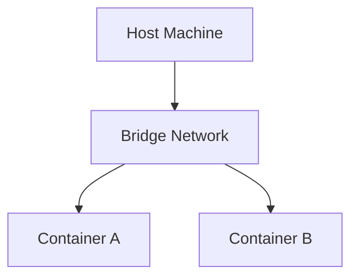
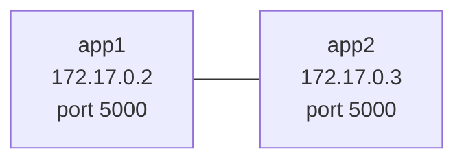

# 05 - Docker Networking

## Goal of This Step
Understand how containers communicate:
- With each other
- With the host (browser)
- Across different networks

And learn how Docker networking enables real-world application architecture.

## 1. What Problem It Solves

So far, we have learned how to:

- Build Docker images
- Run containers
- Access containers using port mapping

However, real-world applications are not single containers.

They consist of multiple services:

- Frontend
- Backend
- Database

These services need to communicate with each other.

Without proper networking:

- Containers remain isolated
- Services cannot communicate
- Real applications cannot function

## 2. What Happened

I started by running two containers using the same image:
```bash
docker run -d --name app1 flask-app:v1
docker run -d --name app2 flask-app:v1
```

Both containers were running successfully.
At this point, I wanted to test if one container could communicate with the other.

### Testing communication

I entered into app1 container:
```bash
docker exec -it app1 sh
```

Then tried:
```bash
ping app2
```
This failed.

### Understanding current network
Before doing anything else, I checked how Docker networking looks by default:
```bash
docker network ls
```
I saw networks like:

- bridge
- host
- none

Then I inspected the default bridge network:
```bash
docker network inspect bridge
```
I observed:

- Containers were assigned IPs like 172.17.x.x
- Both app1 and app2 were inside this network

However, they still could not communicate using names.

### Visual



### Trying IP-based communication

Even though name-based communication failed, I tried using IP:
```bash
ping 172.17.0.3
```
This worked.

This showed:

- Containers can communicate using IP on default bridge
- But NOT using container names

### Creating custom network

To fix this, I created a custom network:
```bash
docker network create my-network
```
Then ran new containers:
```bash
docker run -d --name app3 --network my-network flask-app:v1
docker run -d --name app4 --network my-network flask-app:v1
```
### Testing again

I entered into app3:

```bash
docker exec -it app3 sh
```
Installed ping:
```bash
apt update
apt install -y iputils-ping
```
Then ran:
```bash
ping app4
```
**Output:**
```bash
PING app4 (172.18.0.3) 56(84) bytes of data.
64 bytes from app4.my-network (172.18.0.3): icmp_seq=1 ttl=64 time=1.49 ms
64 bytes from app4.my-network (172.18.0.3): icmp_seq=2 ttl=64 time=0.399 ms
64 bytes from app4.my-network (172.18.0.3): icmp_seq=3 ttl=64 time=0.145 ms
```
This worked successfully.

This clearly showed:
- Custom networks allow name-based communication
- Docker provides automatic DNS in user-defined networks


At this point, we know what happened, but we don’t yet understand *why* it behaves this way.

## 3. Why It Happens

To understand this behavior, we need to understand how Docker networking works internally.


### Network Isolation

Each container runs in its own **network namespace**.

To understand this better, think of each container as a separate machine.

Even though they are running on the same laptop, Docker isolates them so that each container behaves like its own independent system.

- It has its own IP address
- Its own network interface
- Its own port space

This is why multiple containers can use the same port (e.g., 5000) without conflict.

### Default Bridge Network

When we run a container without specifying any network, Docker automatically places it into the **default bridge network**.

This is a built-in network created by Docker when it is installed.

In this network:

- Each container gets a private IP address (usually in 172.17.x.x range)
- Containers can communicate with each other using IP addresses
- However, container names are NOT resolved automatically

This means:

```bash
ping 172.17.0.3   ✔ works
ping app2         ❌ fails
```
This happens because the default bridge network does not provide a DNS service for container names.

Because of this limitation, the default bridge network is not suitable for real-world applications.


### Same port in multiple containers

Both containers can run: 
> Port 5000

because they are isolated.


### Visual



### Why Name Resolution Fails

Default bridge network does NOT include DNS for container names.

So Docker does not know what "app2" means.

### Custom Network

When we create a custom network:

```bash
docker network create my-network
```

Docker enables:

- Automatic DNS resolution
- Container name-based communication

So now:
```bash
ping app4 ✔
```
works.

### Visual


### Key Difference
| Feature                  | Default Bridge | Custom Network |
|--------------------------|:--------------:|:--------------:|
| IP communication         | ✔              | ✔              |
| Name-based communication | ❌             | ✔              |
| DNS support              | ❌             | ✔              |


## 4. Solution

Now that we understand the problem and how Docker networking works, the solution becomes clear.

There are two types of communication we need to handle:

### 1. Host → Container (Browser Access)

If we want to access a container from the browser, we use **port mapping**:

```bash
docker run -p 5000:5000 flask-app:v1
```

This maps:

host:5000 → container:5000

### 2. Container → Container (Service Communication)

If containers need to talk to each other, we use a custom Docker network:
```bash
docker network create my-network
docker run --network my-network
```
This allows:

- Containers to discover each other using names
- Automatic DNS resolution

### 3. Combined Real-World Setup

In real-world applications, we usually combine both:

```bash
docker run -d --name app1 -p 5000:5000 --network my-network flask-app:v1
docker run -d --name app2 -p 8080:5000 --network my-network flask-app:v1
```
This allows:

- Browser → app1/app2 (via port mapping)
- app1 ↔ app2 (via Docker network)

## 5. Deep Understanding

At this point, we understand how to make containers communicate.

Now the important question is:

**How does Docker actually manage networking internally, and how is this used in real-world systems?**

### 1. How Docker Assigns IPs and Subnets

When we create a network:

```bash
docker network create my-network
```
Docker automatically assigns a subnet, for example:

>172.18.0.0/16

Docker uses an internal system called IP Address Management (IPAM) to:

Track which subnets are already in use
Assign a new subnet that does not conflict
Allocate IPs to containers inside that network

Each container gets a unique IP from this range.

### 2. How Containers Are Connected Internally

When a container is connected to a network, Docker:

- Creates a virtual network interface inside the container
- Connects it to a virtual bridge (like a switch)
- Assigns an IP address
- Adds routing rules

This is handled by the Linux kernel using:

- Network namespaces
- Virtual Ethernet (veth pairs)
- Bridge interfaces

You can see part of this using:

```bash
ip addr
ip route
```

### 3. Why Custom Networks Have DNS (and bridge does not)

Default bridge network:

- Basic connectivity only
- No automatic DNS resolution

Custom networks:

- Include an internal DNS server
- Automatically map container names → IP addresses

So:

> app4 → 172.18.0.3

is resolved internally by Docker.
This is why:
```bash
ping app4 ✔
```
works only in custom networks.

### 4. Why We Should Not Use IP Addresses

Even though IP communication works:

```bash
ping 172.17.0.3
```

it is not used in real systems because:

- Container IPs change when recreated
- Hard to manage across environments
- Not scalable

Instead, we always use:
```bash
container-name:port
```
This makes systems predictable and maintainable.

### 5. Multiple Networks per Container (Real Design Pattern)

A container can be connected to multiple networks.

Example:
```bash
docker network connect frontend-net backend
```
Now backend has:

- One IP in frontend-net
- One IP in backend-net

This allows controlled communication:

- Frontend → Backend ✔
- Backend → Database ✔
- Frontend → Database ❌

This pattern is used to:

- Isolate services
- Control access
- Improve security

### 6. Difference Between Port Mapping and Networking

This is one of the most important distinctions:


| Type                     | Purpose                |
|--------------------------|:----------------------:|
| Port Mapping (-p)        | Host → Container       |
| Docker Network           | Container → Container  |


Example:

>Browser → localhost:5000 → container
>Container → backend:5000 → other container

### Host vs Container vs Network


In real-world applications, we usually:

- Expose frontend to browser using port mapping
- Keep backend and database inside Docker networks
- Control communication using multiple networks


This is similar to how systems are designed in cloud environments.

## 6. Commands
```bash
docker network ls
docker network create my-network
docker network inspect my-network
docker run --network my-network
docker network connect my-network app1
docker network disconnect my-network app1
docker inspect app1
```


## 7. Real-World Notes
- Containers are isolated by default
- Custom networks are required for real applications
- Always use container names instead of IPs
- Use multiple networks for security
- Only expose required services


## 8. Exercises
- Run containers in default bridge and test communication
- Create custom network and test again
- Use IP vs name communication
- Attach container to multiple networks
- Inspect network and container details
- Build frontend-backend-db structure

## Key Takeaways
- Containers use isolated network namespaces
- Same ports can run in multiple containers
- Host ports must be unique
- Default bridge lacks DNS
- Custom networks enable name resolution
- Containers can connect to multiple networks
- Networking controls communication and isolation

## Final Note

Docker networking is one of the most important concepts.

Understanding this means you understand:

- Service communication
- Isolation
- Microservice architecture basics