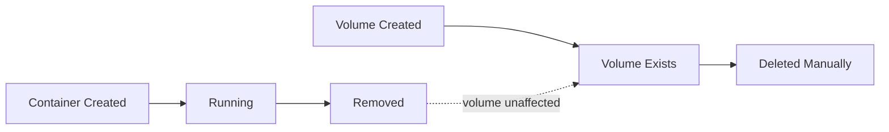

# 11 — Volume Persistence


## 0. Goal of This Step

Go deeper on how Docker volumes actually persist data — what survives what, what gets lost when, how volumes behave across container recreations and image upgrades, and how to safely back up and restore volume data. This step turns volume usage from "it works" into "I know exactly what is happening."


## 1. What Problem It Solves

In step 10 you learned that named volumes survive `docker compose down`. That is the basic answer. But real questions come up quickly:

- If I upgrade my image, does the volume data survive?
- If I rename my service in the Compose file, does it still connect to the old volume?
- What if two projects accidentally use the same volume name?
- How do I back up volume data before doing something risky?
- What if the volume has old data that conflicts with the new image?

These are not edge cases — they are things that happen in normal development and production workflows. This step answers all of them precisely, using the same backend app from step 10.


## 2. What Happened (Experience)

Starting from the step 10 setup — backend with `/notes` endpoints and a named volume `backend-data` mounted at `/app/data`.


**Scenario 1 — Does data survive an image upgrade?**

You have notes saved in the volume. Now you update the backend code — maybe you add a new endpoint or change the response format. You rebuild and redeploy:

```bash
# Add a note first
curl -X POST http://localhost:5000/notes \
  -H "Content-Type: application/json" \
  -d '{"note": "written before upgrade"}'

# Make a code change to app.py (add a comment or change a message)

# Then rebuild
docker compose up -d --build
```

Read the notes:

```bash
curl http://localhost:5000/notes
# {"notes": ["written before upgrade"]}
```

The note survived. The image changed, the container was recreated from the new image but the volume was not touched. Data and code are completely independent. This is the core promise of volumes.


**Scenario 2 — What happens when you rename the service?**

Your `docker-compose.yml` currently has:

```yaml
services:
  backend:
    volumes:
      - backend-data:/app/data

volumes:
  backend-data:
```

Add some notes, then rename the service from `backend` to `api` in the Compose file:

```yaml
services:
  api:                          # renamed
    volumes:
      - backend-data:/app/data  # volume name unchanged

volumes:
  backend-data:
```

Bring it down and back up:

```bash
docker compose down
docker compose up -d
```

Read notes:

```bash
curl http://localhost:5000/notes
# {"notes": ["written before upgrade"]}
```

Data survived because the **volume name** (`backend-data`) did not change, only the service name did. The volume is identified by its name, not by which service uses it.

Service names are irrelevant to volume identity. Volume names are what matter.

Now try the opposite — keep the service name but rename the volume:

```yaml
services:
  backend:
    volumes:
      - new-data:/app/data     # volume name changed

volumes:
  new-data:
```

Bring it down and back up. Read notes:

```bash
curl http://localhost:5000/notes
# {"notes": []}
```

Empty. Docker created a fresh volume called `new-data`. The old `backend-data` volume still exists with all your data — it is just not mounted anymore. Run `docker volume ls` and you will see both volumes sitting there.

This is a common mistake — renaming a volume in the Compose file accidentally orphans your data.


**Scenario 3 — The volume already has data when a new container starts**

You have notes in your volume. You completely delete the backend service's container and start fresh:

```bash
docker compose down
docker compose up -d
```

The new container starts, mounts the volume at `/app/data`, and finds `notes.txt` already there. It reads it correctly. The volume does not care whether the data was written by the previous container or ten containers ago — it just stores files.

But now imagine you change the app to use a different file path — say `/app/storage` instead of `/app/data`. You update the code and the Compose mount:

```yaml
volumes:
  - backend-data:/app/storage  # path changed
```

The old data is still in the volume but at the path the old code wrote to (`/app/data`). The new code looks at `/app/storage` — finds nothing. The data is not lost, just unreachable at the new path. Run `docker volume inspect` to find the mountpoint and you will see the old `data/` directory sitting there with your files — the mount path inside the container changed but the volume contents did not reorganize themselves.


## 3. Why It Happens

A Docker named volume is an independent object managed by Docker. It has its own lifecycle completely separate from containers, images, and Compose projects.

A volume is identified by its name (with a project prefix in Compose). Containers only reference it — they do not own it.

Think of it like an external hard drive. The container is the laptop. The volume is the hard drive. You can plug the hard drive into any laptop, format the laptop, buy a new laptop — the hard drive keeps its data regardless.

The relationship looks like this:

```
Volume lifecycle:        Created → Used by containers → Still exists after containers gone
Container lifecycle:     Created → Running → Stopped → Removed
Image lifecycle:         Built → Used to create containers → Can be deleted independently
```


None of these lifecycles are coupled to each other. A volume exists until you explicitly delete it with `docker volume rm` or `docker compose down --volumes`. Not before.

This is why renaming a volume in Compose creates a new empty volume — Compose looks for a volume with the new name, doesn't find one, creates it. The old volume with the old name still exists untouched, just no longer referenced by anything.


## 4. Solution

**Rules for safe volume management:**

**1. Never rename a volume unless you intend to start fresh**
If you need to rename, manually migrate the data first (covered in Deep Understanding).

**2. Check existing volumes before bringing up a new project**
Run `docker volume ls` regularly. If you see volumes you don't recognize, inspect them before deleting.

**3. Use `docker compose down` not `docker compose down --volumes` for normal teardown**
Reserve `--volumes` for when you genuinely want to wipe all data — CI pipelines, fresh starts, or after a migration.

**4. Keep volume names descriptive and project-specific**
`backend-data` is okay for personal projects. In teams, use `projectname-backend-data` to avoid collisions across projects.

**5. Back up before risky operations**
Before upgrading database versions, changing volume mount paths, or doing anything structural — back up first. The backup procedure is in the Deep Understanding section below.


## 5. Deep Understanding

### Volume Lifecycle Is Fully Independent

Run this sequence and observe each step:

```bash
# Create a volume manually
docker volume create test-vol

# Use it with a temporary container, write data
docker run --rm -v test-vol:/data alpine sh -c "echo 'hello' > /data/test.txt"

# Container is gone (--rm removes it automatically)
docker ps -a
# test-vol container is not here

# Volume still exists
docker volume ls
# test-vol is listed

# Read the data with a brand new container
docker run --rm -v test-vol:/data alpine cat /data/test.txt
# hello

# Delete the volume manually
docker volume rm test-vol
```

The volume outlived both containers. Neither container removal touched it. This is the mental model — volumes are infrastructure, containers are compute.

### How Compose Names Volumes

When Compose creates a volume from your YAML, it prefixes the project name:

```
Your YAML name:     backend-data
Actual Docker name: 10-compose-volumes_backend-data  (project prefix added)
```

This is why two different Compose projects can both declare a volume named `backend-data` without colliding — they become `project-a_backend-data` and `project-b_backend-data`.

But it also means if you change your project name (by moving the folder or using `-p`), Compose will not find the old volume — it will look for `new-project-name_backend-data` and create a new empty one. Your data is still in `old-project-name_backend-data`.

Always be aware of your project name. Check it with:

```bash
docker compose ls
# NAME                    STATUS
# 11-volumes-persistence  running(2)
```

### Backing Up a Volume

Before doing anything risky — upgrading a database image, changing mount paths, restructuring the app — back up the volume data:

```bash
# Backup: run a temporary container, mount the volume and a local directory,
# tar the volume contents into the local directory
docker run --rm \
  -v 11-volumes-persistence_backend-data:/source:ro \
  -v $(pwd):/backup \
  alpine tar czf /backup/backup.tar.gz -C /source .
```

This creates `backup.tar.gz` in your current directory containing everything from the volume. The `:ro` flag mounts the volume read-only — the backup container cannot accidentally modify your data.

### Restoring a Volume From Backup

```bash
# Create a fresh volume
docker volume create restored-data

# Restore into it
docker run --rm \
  -v restored-data:/target \
  -v $(pwd):/backup \
  alpine tar xzf /backup/backup.tar.gz -C /target
```

Now `restored-data` contains everything from your backup. You can mount it into any container.

### Migrating Data Between Volumes

When you need to rename a volume properly — not just update the YAML and lose data — migrate first:

```bash
# Copy all data from old volume to new volume
docker run --rm \
  -v old-volume:/source:ro \
  -v new-volume:/target \
  alpine cp -r /source/. /target/
```

Then update the Compose file to use `new-volume`. Bring up, verify data is there, then delete `old-volume`:

```bash
docker volume rm old-volume
```

### Volume Initialization From Image

There is one subtle behavior that surprises people: if a volume is **empty** and it is mounted at a path that already contains files in the image, Docker copies the image's files into the volume on first mount.

Example: if your image has files at `/app/data/defaults/` and you mount an empty volume at `/app/data`, the volume will be initialized with those default files on the first run.

This only happens **once** — on first mount of an empty volume. After that, the volume's own contents take precedence and image files at that path are never copied again. If you want to reset to defaults, you have to delete the volume and let Docker initialize it fresh.

This is actually how official database images (Postgres, MySQL) work — the database data directory in the image contains initialization scripts that run when the volume is empty (first run), setting up the database schema. On subsequent runs, the volume already has data so initialization is skipped.

### Dangling Volumes

Over time you will accumulate volumes that are no longer referenced by any container. These are called **dangling** volumes. They take up disk space silently.

```bash
# See all dangling volumes
docker volume ls -f dangling=true

# Remove all dangling volumes at once
docker volume prune

# See how much space volumes are using
docker system df
```

Run `docker volume prune` periodically to clean up. It only removes volumes not currently mounted by any container — it will not touch volumes in use.


## 6. Commands

```bash
# ── Volume Inspection ──────────────────────────────────────────────────────

docker volume ls                             # list all volumes
docker volume ls -f dangling=true            # only unreferenced volumes
docker volume inspect <name>                 # full details, mountpoint location
docker volume rm <name>                      # delete a specific volume
docker volume prune                          # delete all dangling volumes

# ── Backup and Restore ─────────────────────────────────────────────────────

# Backup volume to tar file
docker run --rm \
  -v <volume-name>:/source:ro \
  -v $(pwd):/backup \
  alpine tar czf /backup/backup.tar.gz -C /source .

# Restore from tar file into a volume
docker run --rm \
  -v <volume-name>:/target \
  -v $(pwd):/backup \
  alpine tar xzf /backup/backup.tar.gz -C /target

# Copy data between two volumes
docker run --rm \
  -v source-vol:/source:ro \
  -v target-vol:/target \
  alpine cp -r /source/. /target/

# ── Checking Volume Space ──────────────────────────────────────────────────

docker system df                            # storage usage summary
docker system df -v                         # verbose, per-volume breakdown

# ── Compose Specific ───────────────────────────────────────────────────────

docker compose down                         # keeps volumes
docker compose down --volumes               # deletes volumes too
docker compose ls                           # see project name
```


## 7. Real-World Notes

The single most important habit from this step: **always back up a volume before doing anything structural** — before upgrading a database image, before changing the mount path, before renaming a volume. It takes thirty seconds and has saved many engineers from hours of data recovery work.

In production, volumes on a single machine are not sufficient for critical data. Production databases use managed cloud services (AWS RDS, Google Cloud SQL) instead of a Postgres container with a local volume because managed services handle replication, automated backups, and failover. Docker volumes are excellent for development and for stateless workloads. For production stateful data, the industry generally delegates to dedicated storage services.

The volume initialization behavior (image files copied into empty volume on first mount) is the mechanism that makes official database images work so smoothly. When you run Postgres for the first time with an empty volume, the image initializes the data directory automatically. On every subsequent run it skips initialization because the volume already has data. Understanding this saves a lot of confusion in step 13 when we set up the real Postgres service.

Dangling volume cleanup (`docker volume prune`) is worth adding to your regular Docker hygiene routine alongside `docker image prune` and `docker container prune`. On an active development machine these can accumulate gigabytes over weeks.


## 8. Exercises

**Exercise 1 — Survive an image upgrade**
Add notes to the backend. Change something minor in `app.py` (a response message). Rebuild with `docker compose up -d --build`. Verify the old notes are still there. This confirms that rebuilding an image and recreating the container does not touch volume data.

**Exercise 2 — Rename the volume and see what happens**
Add notes. Change the volume name in `docker-compose.yml` from `backend-data` to `backend-data-v2`. Bring it down and back up. Check the notes — empty. Run `docker volume ls` — both `backend-data` and `backend-data-v2` exist. The old data is sitting in `backend-data`, unreachable. This is how data gets orphaned.

**Exercise 3 — Migrate data between volumes properly**
Using the orphaned `backend-data` from Exercise 2, use the `alpine cp` migration command to copy data into `backend-data-v2`. Verify the notes are now accessible in the running app. Delete the old `backend-data` volume. You just performed a volume migration without losing data.

**Exercise 4 — Back up and restore**
Add several notes. Run the backup command and create `backup.tar.gz`. Run `docker compose down --volumes` to wipe everything. Run `docker compose up -d` — notes are gone. Now restore from the backup tar file into a fresh volume. Bring the stack down and up again — notes are back. This is full disaster recovery in miniature.

**Exercise 5 — Volume initialization from image**
Add a directory to your backend image with a default file. In the Dockerfile, after `COPY . .` add:
```dockerfile
RUN mkdir -p /app/data && echo "default note" > /app/data/notes.txt
```
Delete your existing volume (`docker volume rm`). Bring the stack up fresh. Read the notes — the default note from the image is there. Now add another note and restart. The image's default is no longer copied — the volume's own content takes over. This is the initialization behavior.

**Exercise 6 — Find and prune dangling volumes**
Stop your running stack with `docker compose down` (not `--volumes`). Run `docker volume ls -f dangling=true` — your volume appears as dangling because no container is currently using it. Now run `docker compose up -d` and check again — it disappears from the dangling list because a container mounted it. Run `docker volume prune` while the stack is running — your volume is safe. This shows that `prune` only removes truly unused volumes.