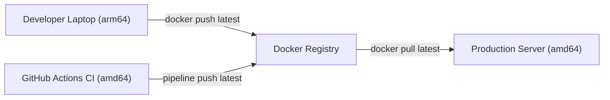
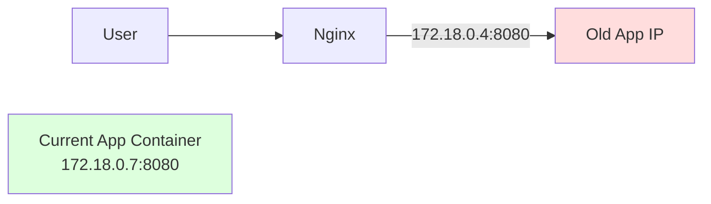
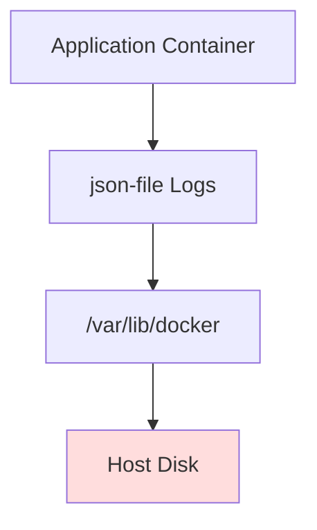
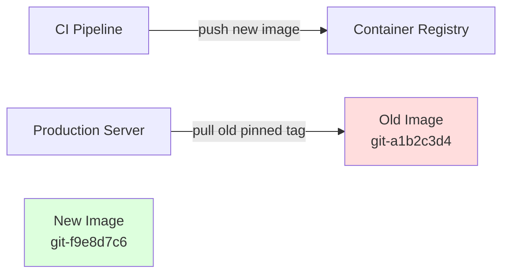
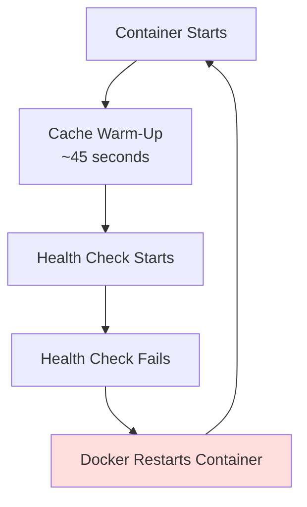
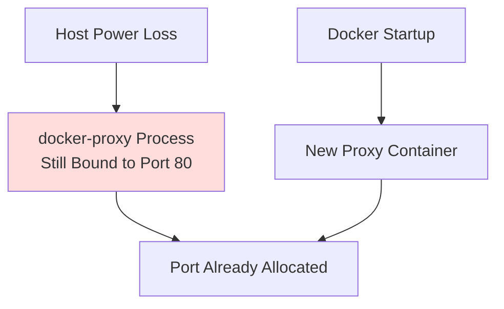
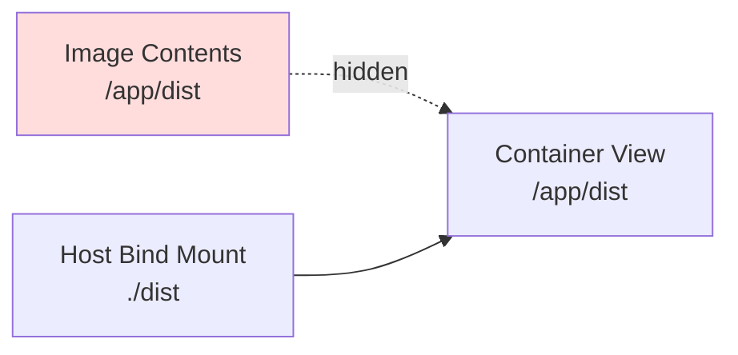
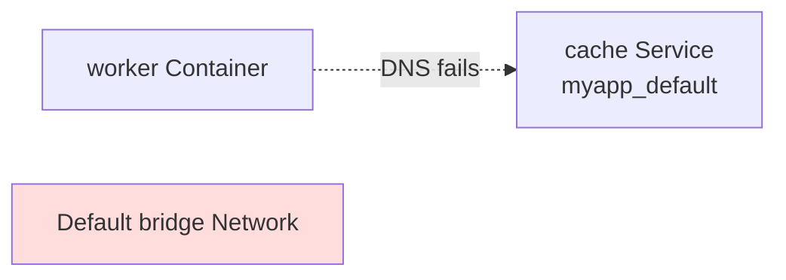

# 26 — Production Incident Case Studies


## 0. What This Step Is

The previous steps built capability: writing production Dockerfiles, securing images, adding health checks, enforcing resource limits, tagging releases, pushing to registries, and wiring up CI/CD pipelines. Each step presented a clean problem with a clear objective.

Production does not work that way. Problems arrive unannounced, without labels, at inconvenient hours. The same symptom — a container that will not start, a service returning 502, a deployment that reports success while traffic is failing — can have ten different root causes. The ability to navigate from symptom to root cause, under pressure, with incomplete information, is what separates operational competence from operational anxiety.

This step is nine case studies. Each is a real class of incident encountered by platform engineers, SREs, and infrastructure teams running Docker in production. The scenarios are technology-agnostic: the application could be Node.js, Go, Java, PHP, Python, or anything else. The problems are at the infrastructure layer — the container runtime, the host, the network, the registry, the daemon, the deployment pipeline and the thinking process is the same regardless of what the application does.

The focus is not on the solution. It is on the investigation: which commands were run, what each one revealed, which hypotheses were formed and eliminated, and how the path from symptom to root cause actually unfolded. Real incidents include dead ends. Real investigations involve ruling things out before finding the answer. That is what these scenarios try to capture.

---


## Scenario 1 — exec format error: The Image That Would Not Start Anywhere Except the Developer's Machine

### Context

A team was preparing the first production deployment of a new service. The Dockerfile had been tested locally, the CI/CD pipeline built the image successfully, and the deployment job pulled the image onto the production server using docker compose up -d.

The deployment appeared successful — until the container immediately exited.



### What Happened

`docker compose ps` showed the container in a restart loop within seconds of starting:

```
NAME        SERVICE     STATUS                       PORTS
api         api         restarting (1) 3 seconds ago
```

The logs showed a single line and nothing else:

```bash
docker compose logs api
```

```
standard_init_linux.go:228: exec user process caused: exec format error
```

No application logs appeared. The container failed before the application itself had a chance to start.

### Investigation

exec format error is generated by the Linux kernel, not by the application runtime. It indicates that the operating system attempted to execute a binary compiled for a different CPU architecture.

The first verification step was checking the architecture metadata of the image running on the server:

```bash
docker image inspect registry.example.com/api:latest --format='{{.Architecture}}'
```

```
arm64
```

The production server was running amd64 hardware. The image was built for arm64.

The kernel rejected the executable because the binary format did not match the host architecture.

The next step was determining how an arm64 image ended up in production. The CI pipeline used GitHub Actions ubuntu-latest, which builds amd64 images by default. Attention shifted to the registry itself:

```bash
docker buildx imagetools inspect registry.example.com/api:latest
```

```
Name:      registry.example.com/api:latest
Platform:  linux/arm64
```

The registry contained only a single-platform arm64 image.

Reviewing the registry history showed that a developer had manually pushed an image from an Apple Silicon MacBook after the CI pipeline completed. That manual push overwrote the latest tag with an arm64 image.

Production subsequently pulled latest and received the incompatible architecture.


### Root Cause

A manually pushed `arm64` image replaced the CI-generated amd64 image under the mutable `latest` tag.

The production server — running `amd64` — pulled the overwritten image. The Linux kernel could not execute the `arm64` binary and terminated the container immediately with `exec format error`.

### Fix

The immediate recovery step was rebuilding and pushing the correct image from the CI pipeline:

```bash
docker compose pull api
docker compose up -d api
```

```
Pulling api ... done
Recreating api ... done
```

The container started successfully once the correct `amd64` image was deployed.

### Prevention

Two operational weaknesses enabled the incident.

The first was allowing direct image pushes from developer machines to production tags. Registry permissions were updated so only the CI pipeline could push to deployment tags such as latest or release versions.

The second issue was deploying mutable tags in production. Tags like latest can be silently overwritten without any deployment configuration change. Production deployments should instead reference immutable tags or digests:

```bash
image: registry.example.com/api:git-a1b2c3d
```

For mixed Apple Silicon and x86 environments, build architecture should also be declared explicitly:

```bash
docker buildx build --platform linux/amd64
```

If multi-architecture support is required, a proper multi-platform manifest should be published:

```bash
docker buildx build \
  --platform linux/amd64,linux/arm64
```

This allows Docker to automatically pull the correct image variant for the target machine architecture.

---


## Scenario 2 — The Reverse Proxy That Kept Returning 502

### Context

A production environment consisted of three containers:

an Nginx reverse proxy exposed on port 443
an application container listening on port 8080
a cache container

The stack had been stable for several weeks. A deployment was triggered containing only a configuration change to an environment variable. No application code had changed.

The deployment completed successfully, but within ninety seconds every request through the reverse proxy began returning `502 Bad Gateway`.



### What Happened

The deployment used a forced container recreation:

```bash
docker compose up -d --force-recreate app
```

The CI/CD pipeline completed successfully.

`docker compose ps` showed all containers healthy.

However, every request through Nginx returned:

```bash
502 Bad Gateway
nginx/1.25.3
```

The application container appeared healthy. The reverse proxy itself was also running normally.

The failure existed somewhere between the proxy and the application container.


### Investigation

The first step was checking the Nginx error log:

```bash
docker compose exec proxy tail -50 /var/log/nginx/error.log
```
```
2026-05-08 21:14:37 [error] 29#29: *1483 connect() failed (111: Connection refused)
while connecting to upstream, client: 10.0.1.55, server: api.example.com,
request: "GET /api/health HTTP/1.1",
upstream: "http://172.18.0.4:8080/api/health",
host: "api.example.com"
```

The important detail was:

```bash
upstream: "http://172.18.0.4:8080"
```

Nginx was attempting to connect to 172.18.0.4.

The next step was verifying the actual IP address of the running application container:

```bash
docker inspect app --format='{{range .NetworkSettings.Networks}}{{.IPAddress}}{{end}}'
```
```
172.18.0.7
```
The running container was no longer using `172.18.0.4`.

The proxy was attempting to reach an IP address that no longer belonged to the application container.

Attention shifted to the Nginx upstream configuration:

```bash
docker compose exec proxy cat /etc/nginx/conf.d/app.conf
```

```nginx
upstream app_backend {
    server 172.18.0.4:8080;
}
```

The upstream used a hardcoded container IP address instead of a Docker service name.

Reviewing deployment history explained why the issue had remained hidden for weeks.

During the original deployment, Docker assigned the application container `172.18.0.4`. Subsequent restarts happened in the same sequence, and Docker repeatedly reused the same IP assignment from its internal IPAM pool.

The `--force-recreate` deployment changed container startup ordering. Docker assigned the recreated application container a new address: `172.18.0.7`.

Nginx continued attempting to connect to the old IP address because the upstream configuration contained a literal IP, not a hostname.

The application itself was still healthy:

```bash
docker compose exec proxy curl -s http://172.18.0.7:8080/health
```

```json
{"status":"ok","version":"2.4.1"}
```
The reverse proxy configuration was the only broken component.


### Root Cause

The Nginx upstream configuration used a hardcoded container IP address.

Docker container IP addresses are ephemeral and can change whenever containers are recreated, restarted in a different order, or rescheduled onto another network namespace.

The deployment altered container recreation order, Docker assigned a new IP address to the application container, and Nginx continued attempting to connect to the obsolete address.

### Fix

The upstream configuration was updated to use the Docker service name instead of a fixed IP address:

```nginx
upstream app_backend {
    server app:8080;
}
```

Docker's embedded DNS resolver dynamically resolves service names to the current container IP.

The proxy container was recreated with the corrected configuration:

```bash
docker compose up -d --force-recreate proxy
```

The 502 errors stopped immediately.

Multiple restart and recreation cycles were tested afterward to confirm that service discovery remained stable regardless of container startup order.


### Prevention

Container IP addresses in Docker networks are ephemeral. Never hardcode them. Every inter-container connection should use the service name as the hostname. Docker's embedded DNS server, which runs at `127.0.0.11` inside every container, resolves service names to the current container IP dynamically. This works across restarts, scaling events, and any other operation that changes container assignment.

When debugging 502 errors through a reverse proxy, the path is always the same: check the proxy error log first, then check what IP the upstream container actually has, then verify the current container IP, inspect how the upstream target was configured and then determine whether service discovery or networking drift occurred.

Most reverse proxy failures are not application failures — they are routing, DNS, or upstream resolution failures.

---


## Scenario 3 — The Server That Ran Out of Disk at 3 AM

### Context

A production server had been running a small container stack for several months:

- application container
- PostgreSQL container
- Nginx reverse proxy

No major traffic spikes had occurred. No recent deployments had been made.

At 3:14 AM, the monitoring system reported that the application container had stopped and was no longer restarting despite a restart policy of `unless-stopped`.



### What Happened

Attempting to restart the container manually:

```bash
docker compose up -d app
```

```
Error response from daemon: failed to create shim task:
OCI runtime create failed:
rootfs_mount_failed caused:
mkdir /var/lib/docker/overlay2/.../merged:
no space left on device
```

No space left on device. The server's disk was full.

### Investigation

The first verification step was checking filesystem usage:

```bash
df -h
```

```
Filesystem      Size  Used Avail Use% Mounted on
/dev/sda1        40G   40G     0 100% /
```

The root filesystem had reached 100% utilization.

The next step was identifying which directories consumed the most space:

```bash
du -sh /* 2>/dev/null | sort -rh | head -10
```

```
29G     /var
6.2G    /usr
1.8G    /home
1.1G    /opt
```

Most usage was inside /var.

Further inspection narrowed it down to Docker storage:

```bash
du -sh /var/lib/* 2>/dev/null | sort -rh | head
```

```
26G     /var/lib/docker
```

Docker itself appeared to be consuming most of the disk.

`docker system df` showed some reclaimable space, but not enough to explain 26 GB of usage:

```bash
docker system df
```

```
TYPE            TOTAL     ACTIVE    SIZE
Images          8         3         2.1GB
Containers      3         0         2.8GB
Volumes         2         1         145MB
```
The missing storage usage pointed toward something outside normal image and container accounting.

Attention shifted to the container directories directly:

```bash
du -sh /var/lib/docker/containers/*/
```
```
22G  /var/lib/docker/containers/d4e5f6.../
```
One container directory alone consumed 22 GB.

The container ID matched the application container:

```bash
docker ps -a --format '{{.ID}} {{.Names}}'

# d4e5f6789abc app
```
Inspecting the directory contents revealed the problem:

```bash
ls -lh /var/lib/docker/containers/d4e5f6789abc/
```
```
-rw-r--r-- 1 root root 22G d4e5f6789abc-json.log
```

The Docker json-file logging driver had accumulated a single 22 GB log file.

Reviewing the log contents showed repeated health check requests:

```bash
tail -5 d4e5f6789abc-json.log
```

```
GET /healthz 200 2ms
GET /healthz 200 2ms
GET /healthz 200 2ms
```
The application logged every HTTP request, including health probes.

The health check executed once per second for several months with no log rotation configured.

The log file continuously grew until the host filesystem was exhausted.

### Root Cause

Docker's default `json-file` logging driver was running without any rotation policy.

The application logged every health check request to stdout, generating millions of log lines over several months. The resulting log file grew to 22 GB and filled the entire host disk.

Once disk space was exhausted, Docker could no longer create new overlay2 filesystem layers required for container startup.

### Fix

The immediate priority was recovering disk space.

The log file was truncated in place:

```bash
truncate -s 0 \
/var/lib/docker/containers/d4e5f6789abc/d4e5f6789abc-json.log
```

Disk utilization immediately dropped.

The application container then started successfully:

```bash
docker compose up -d app
```

Log rotation was added to `docker-compose.yml`:

```yaml
services:
  app:
    logging:
      driver: "json-file"
      options:
        max-size: "50m"
        max-file: "5"
```
This capped log growth at approximately 250 MB for the container.

Application-level request logging was also updated to suppress routine health probe entries.

### Prevention

Production containers should always define explicit log rotation policies.

Docker's default logging behavior is acceptable for development environments but dangerous for long-running servers.

Host-level defaults can also be enforced globally:

```json
{
  "log-driver": "json-file",
  "log-opts": {
    "max-size": "50m",
    "max-file": "5"
  }
}
```

Operational monitoring should include:

disk usage alerts on `/var/lib/docker`
periodic review of container log growth
monitoring for unusually high log generation rates

`docker system df` alone is not sufficient during disk investigations because it does not fully account for large container log files.

---


## Scenario 4 — The Deployment That Reported Success While Traffic Was Failing

### Context

A team deployed applications using a simple CI/CD workflow:

```
build image → push to registry → SSH into server →
docker compose pull → docker compose up -d
```

The deployment pipeline had worked reliably for months.

A small configuration change was deployed on a Friday afternoon. The pipeline completed successfully and reported:

```
Deployment successful ✓
```

Fifteen minutes later, users began reporting application failures.

Monitoring showed the failures started immediately after the deployment completed.




### What Happened

The deployment itself appeared healthy.

```bash
docker compose ps
```

showed:

- running containers
- no restart loops
- healthy status checks

The application `/health` endpoint also returned `200 OK`.

Despite this, user-facing requests were failing.

This type of incident is particularly misleading because:

- infrastructure appears healthy
- containers are running
- health checks pass
- deployment reports success

while production traffic is still broken.

### Investigation

The first step was verifying which image the running container actually used:

```bash
docker inspect app --format='{{.Config.Image}}'
```
```
registry.example.com/app:git-a1b2c3d4
```

The running container used image `git-a1b2c3d4`.

The CI logs from the most recent deployment showed:

```
Built and pushed:
registry.example.com/app:git-f9e8d7c6
```

The deployment pipeline had built a newer image, but production still ran the older one.

Attention shifted to the deployment step itself:

```bash
docker compose pull app
```

```
Pulling app ... done
```

The command reported success, but the image digest on disk remained unchanged.

The next step was reviewing `docker-compose.yml`:

```yaml
services:
  app:
    image: registry.example.com/app:git-a1b2c3d4
```

The compose file still referenced the older image tag.

The CI pipeline built and pushed new images on every run, but the deployment configuration itself never changed. Every deployment continued referencing the same pinned SHA from several weeks earlier.

`docker compose pull` therefore behaved correctly:

- it checked for git-a1b2c3d4
- found the image already present
- reported success
- performed no update

The newly built images existed in the registry but nothing referenced them.

Verification inside the running container confirmed this:

```bash
docker compose exec app cat /app/build-info.json
```

```json
{
  "version": "2.3.0",
  "commit": "a1b2c3d4"
}
```
The production environment had silently remained on the same image for weeks despite multiple "successful" deployments.


### Root Cause

The CI/CD pipeline built and pushed new images successfully but never updated the image tag referenced in `docker-compose.yml`.

Production deployments continued pulling the same old pinned image already cached on the server.

The deployment pipeline verified only that commands executed successfully — not that the intended image was actually running afterward.

### Fix

The deployment workflow was updated to dynamically inject the new image tag during deployment:

```bash
NEW_TAG="git-${GITHUB_SHA:0:8}"

sed -i \
"s|registry.example.com/app:.*|registry.example.com/app:${NEW_TAG}|g" \
docker-compose.yml
```

The deployment then proceeded normally:

```bash
docker compose pull app
docker compose up -d app
```

Post-deployment verification was also added:

```bash
docker inspect app --format='{{.Config.Image}}'
```

The running container tag was compared against the image built by the pipeline.

If the running image did not match the expected deployment tag, the pipeline failed.

### Prevention

Deployment success should never be defined as:

- image built successfully
- commands exited with code 0
- containers are running

The deployment must also verify:

- the correct image was pulled
- the correct container version is running
- the running image digest matches the expected release

Without post-deployment verification, a pipeline is only confirming that deployment commands executed — not that the intended version actually reached production.

Pinned image tags are valuable for reproducibility, but they must be updated as part of the deployment process itself.

---


## Scenario 5 — The Deployment That Killed Itself With Its Own Health Check

### Context

A team had recently added Docker health checks to all services after several earlier incidents involving partially broken containers that still appeared "running."

The application container used the following health check configuration:

- interval: 10 seconds
- timeout: 5 seconds
- retries: 3
- start period: 30 seconds

The application itself performed a large cache warm-up during startup. On production infrastructure, initialisation consistently took approximately 45 seconds.

The next deployment triggered a restart storm.



### What Happened

The deployment completed successfully, but the application never stabilised.

docker compose ps showed continuous restarts:

```bash
docker compose ps
```

```
NAME    SERVICE   STATUS
app     app       restarting (12) 4 minutes ago
```

The container repeatedly started, ran briefly, failed its health check, restarted, and repeated the cycle indefinitely.

### Investigation

The first step was reviewing the application logs from the latest restart cycle:

```bash
docker compose logs --tail=30 app
```
```
Starting application...
Loading configuration...
Connecting to database... connected.
Warming cache — fetching 84,000 records...
Cache warm: 0%
Cache warm: 12%
Cache warm: 24%
Cache warm: 37%
Cache warm: 49%
```

The logs consistently stopped during cache initialisation.

The application never reached the point where it fully started listening for HTTP traffic.

Attention shifted to the health check configuration itself:

```bash
docker inspect app --format='{{json .Config.Healthcheck}}'
```

```json
{
  "Interval": 10000000000,
  "Timeout": 5000000000,
  "Retries": 3,
  "StartPeriod": 30000000000
}
```

The startup timing immediately revealed the problem.

The application needed roughly 45 seconds to initialise under production load, but Docker only allowed a 30-second grace period before counting failed health checks.

Once the start period expired:

- health checks began failing
- Docker marked the container unhealthy
- the restart policy recreated the container
- startup restarted from the beginning

The service never survived long enough to complete initialisation.

Further inspection revealed a second issue hidden underneath the timing problem.

The configured health check command used `curl`:

```bash
curl -sf http://localhost:8080/health || exit 1
```

The production image did not contain `curl`.

Verification inside the container confirmed this:

```bash
docker compose exec app which curl
```
```
(no output)
```

Running the command directly produced:

```bash
docker compose exec app curl http://localhost:8080/health
```
```
bash: curl: command not found
```
The health check failures were therefore misleading.

Docker reported failed health checks as if the application endpoint was unavailable, but the real failure was that the health check binary itself did not exist inside the container.

The restart storm was caused by two independent problems compounding together:

- the application startup time exceeded the configured grace period
- the health check command itself could never succeed

### Root Cause

The application's production startup time consistently exceeded the configured `start_period`, causing Docker to begin counting health check failures before the service became ready.

At the same time, the health check depended on `curl`, which was not installed in the production image. Every health check failed immediately with `command not found`.

Docker interpreted both conditions as application health failures and continuously restarted the container.

### Fix

The health check configuration was updated:

```yaml
services:
  app:
    healthcheck:
      test:
        [
          "CMD",
          "wget",
          "--quiet",
          "--tries=1",
          "--spider",
          "http://localhost:8080/health"
        ]
      interval: 15s
      timeout: 10s
      retries: 3
      start_period: 90s
```
Several changes were made at the same time.
`curl` was replaced with `wget`, which already existed inside the image. The `start_period` was increased to 90 seconds to provide headroom above the maximum observed startup duration. The health check interval and timeout were also increased to reduce startup pressure during heavy initialisation.

The CI pipeline was additionally updated to verify that the health check command existed inside the image before publishing it:

```bash
docker run --rm registry.example.com/app:${NEW_TAG} which wget
```

If the command failed, the build failed immediately.

A health check that cannot execute its own probe command provides no protection and can become an outage trigger itself.


### Prevention

Health checks should be designed around observed production startup behaviour, not assumptions from development environments.

Applications frequently initialise much slower under:

- production datasets
- slower disks
- higher concurrency
- cold cache conditions

The `start_period` should always exceed the worst-case observed startup duration with additional safety margin.

Health checks should also be validated as part of the build process itself. The probe command, binaries, and expected endpoints must all exist inside the final runtime image, not only in development containers.

---


## Scenario 6 — Docker Hub Rate Limits Broke Deployment at the Worst Possible Time

### Context

A team was performing an emergency rollback during a live production incident. Users were already affected, the engineering bridge call was active, and restoring the previous version quickly was the priority.

The rollback process was straightforward:

```bash
docker compose pull
docker compose up -d
```
The application image itself lived in a private registry, but the image had originally been built from Docker Hub base images such as node:20-alpine and alpine:3.19.

A week earlier, the production server had undergone cleanup using docker system prune, which removed unused local images and caches.

During the rollback, the deployment failed immediately.


### What Happened

The rollback command returned:

```bash
docker compose pull
```

```
Pulling app ... error
```

```
Error response from daemon: toomanyrequests: You have reached your pull rate limit.
You may increase the limit by authenticating and upgrading:
https://www.docker.io/increase-rate-limit
```

The rollback could not continue because the required image layers could no longer be downloaded.

The production deployment process itself had become dependent on an external rate-limited service during an active incident.

### Investigation

The first assumption was that Docker Hub itself was being contacted directly from the production server.

Existing local images were checked first:

```bash
docker images | grep -E "node|alpine"
```

```
node      20-alpine   3 weeks ago
alpine    3.19        3 weeks ago
```

Some related base images still existed locally, which initially made the failure confusing.

Attention shifted toward the application image pull itself.

Running the pull command with more verbose output showed the request path more clearly:

```bash
docker compose pull app 2>&1
```

```
Pulling from registry.example.com/app
...
toomanyrequests:
You have reached your pull rate limit.
```

The request was not failing directly against Docker Hub.

The private registry itself was configured as a pull-through cache. When image layers were missing locally in the registry cache, the registry transparently fetched them from Docker Hub.

Because the registry cache used unauthenticated Docker Hub access, it inherited Docker Hub's anonymous pull limits.

Earlier CI activity had already exhausted those limits. During the rollback, the registry attempted to retrieve missing layers from Docker Hub and was denied.

The production deployment failed because the registry backend itself had become rate-limited upstream.

### Root Cause

The private registry operated as a Docker Hub pull-through cache without authenticated upstream credentials.

During the rollback, the registry attempted to retrieve uncached layers from Docker Hub. Docker Hub rate limits had already been exhausted by earlier CI activity, causing the registry to fail image delivery during a production incident.

A prior `docker system prune` on the production server removed locally cached copies of previously deployed images, eliminating the fallback path that would otherwise have avoided the external dependency entirely.

### Fix

The immediate recovery path was bypassing image pulls entirely and using the already cached local application image still present on disk:

```bash
docker images | grep "registry.example.com/app"
```
```
registry.example.com/app   git-a1b2c3d4
```

The deployment configuration was updated to reference the locally available tag:

```bash
docker compose up -d app
```

Because the image already existed locally, Docker reused the cached image without contacting the registry.

The service recovered immediately.

After the incident, authenticated Docker Hub credentials were added to the registry's pull-through cache configuration so upstream requests used authenticated rate limits instead of anonymous limits.

### Prevention

The incident exposed a hidden operational dependency: production deployments were indirectly dependent on Docker Hub availability and rate limits even though a private registry existed.

Rollback procedures should never depend on external services during an outage.

Production servers should retain at least several previously deployed image versions locally so rollbacks can proceed without requiring network pulls. Cleanup commands such as `docker system prune` should be used cautiously on production systems because they can silently remove rollback safety buffers.

Registry caches should also authenticate upstream pulls to avoid low anonymous rate limits. Even better, critical base images should be pre-seeded into internal registries so production deployments are operationally independent from public registries during incidents.

---


## Scenario 7 — Port Already Allocated: The Container That Would Not Start After a Crash

### Context

A single-server deployment was running an application stack behind a reverse proxy. The reverse proxy container listened on ports 80 and 443.

One evening, the host server lost power unexpectedly. After power was restored, the automated startup process executed docker `compose up -d`.

The proxy container failed immediately:

```
Error response from daemon: driver failed programming external connectivity on endpoint proxy
(sha256:abc123...): Error starting userland proxy: listen tcp4 0.0.0.0:80: bind: address already in use
```



### What Happened

Port 80 was already bound by another process. The reverse proxy could not start, which made the entire application stack unreachable from outside the server.

### Investigation

The first step was identifying what process held port 80:

```bash
sudo ss -tlnp | grep ':80'
```

```
LISTEN  0  128  0.0.0.0:80  0.0.0.0:*  users:(("docker-proxy",pid=1847,fd=4))
```

A `docker-proxy` process was still listening on the port.

`docker compose ps` showed the proxy container itself was not actually running:

```
NAME    SERVICE   STATUS    PORTS
proxy   proxy     created
db      db        running   5432/tcp
app     app       running   8080/tcp
```

The container existed only in the created state.

This pointed toward an interrupted startup sequence. Docker had already allocated the host port and launched the docker-proxy process before the abrupt power loss interrupted container initialisation.

The leftover docker-proxy process survived the reboot as an orphaned host process, while Docker itself no longer tracked it.

Further verification confirmed this:

```bash
ps -p 1847 -o pid,ppid,comm,args
```

```
  PID  PPID COMM          ARGS
 1847     1 docker-proxy  /usr/bin/docker-proxy -proto tcp -host-ip 0.0.0.0 -host-port 80 ...
```

The process had been re-parented to PID 1 (init), confirming Docker daemon ownership had been lost.

Additional orphaned proxy processes were also checked:

```bash
ps aux | grep docker-proxy | grep -v grep
```

```
root 1847 docker-proxy -host-port 80 ...
root 1849 docker-proxy -host-port 443 ...
```

Both ports used by the reverse proxy still had stale `docker-proxy` processes attached to them.

### Fix

The orphaned processes were terminated manually:

```bash
sudo kill 1847 1849
```

Port verification confirmed the bindings were cleared:

```bash
sudo ss -tlnp | grep -E ':80|:443'
```

```
(no output)
```

The stack then started normally:

```bash
docker compose up -d
```
```
Starting proxy ... done
Starting app   ... done
Starting db    ... done
```

### Prevention

Abrupt host shutdowns can leave Docker networking state partially inconsistent, especially during container startup or port allocation.

Running Docker under systemd with proper dependency ordering reduces the likelihood of startup races after reboot. The compose stack should also start only after the Docker daemon is fully available.

Keeping Docker Engine updated is important as newer versions improved orphaned proxy cleanup behaviour significantly.

A defensive pre-start validation can also be added before deployment startup:

```bash
for port in 80 443; do
  pid=$(ss -tlnp | grep ":${port}" | awk -F'pid=' '{print $2}' | cut -d',' -f1)

  if [ -n "$pid" ]; then
    comm=$(ps -p "$pid" -o comm=)

    if [ "$comm" = "docker-proxy" ]; then
      echo "Killing orphaned docker-proxy on port ${port} (PID ${pid})"
      kill "$pid"
    fi
  fi
done
```

This cleanup targets only orphaned `docker-proxy` processes and avoids accidentally terminating legitimate services such as Nginx or Apache.

---

## Scenario 8 — The Bind Mount That Silently Erased the Application

### Context

A staging deployment was testing a new approach for updating static assets without rebuilding the application image.

The application image already contained compiled frontend assets at /app/dist. A bind mount was added to docker-compose.yml so files on the host could be swapped independently:

```yaml
services:
  app:
    image: registry.example.com/app:latest
    volumes:
      - ./dist:/app/dist
```

A dist/ directory was created on the host with a few test files, and the stack was started normally.

The container came up successfully, but every request for static assets immediately returned 500 errors.




### What Happened

The application container remained healthy:

- no crashes
- no restart loops
- health checks passing

But every request for JavaScript, CSS, or image assets failed with `500 Internal Server Error`.

### Investigation

Application logs showed repeated file lookup failures:

```bash
docker compose logs app
```

```
ENOENT: no such file or directory:
open '/app/dist/main.bundle.js'
ENOENT: no such file or directory:
open '/app/dist/vendor.bundle.js'
ENOENT: no such file or directory:
open '/app/dist/index.html'
```

The application could not find its compiled frontend assets.

Inspecting the mounted directory inside the running container showed only a single test file:

```bash
docker compose exec app ls /app/dist/
```

```
test-file.txt
```
The compiled assets expected by the application were completely missing.

The next step was verifying what originally existed in the image before the bind mount:

```bash
docker run --rm registry.example.com/app:latest ls /app/dist/
```

```
index.html
main.bundle.js
vendor.bundle.js
fonts/
images/
static/
```

All required files existed correctly inside the image itself.

The issue was the bind mount behaviour.

Mounting `./dist:/app/dist` did not merge host files with image files. The host directory completely replaced the container directory view. The image contents still physically existed in the image layers, but they became inaccessible while the mount was active.

The application therefore saw only the host directory contents — which contained a single test file and none of the compiled assets required for rendering.

### Root Cause

The bind mount replaced `/app/dist`, which already contained compiled application assets baked into the image during build time.

The mounted host directory contained only a test file, so the application lost access to all required static assets and failed on every request that depended on them.

### Fix

The immediate fix was removing the bind mount entirely:

```yaml
services:
  app:
    image: registry.example.com/app:latest
    # volumes removed
```

Once the container restarted, the image's built-in assets became visible again and the application recovered immediately.

The longer-term solution depended on the actual deployment requirement.

If the static files are application build artifacts, they should remain inside the image and be deployed together with the application version.

If the static files must change independently, they should be served separately — for example through Nginx using a named volume or external object storage.

### Prevention

Bind mounts never merge contents with image directories. They completely shadow the target path for the duration of the mount.

Before adding a bind mount to a production container, the target directory inside the image should always be inspected first:

```bash
docker run --rm <image> ls -la /path/to/target/
```

If the directory already contains application-critical files, mounting over it will hide them completely.

In production environments, bind mounts are safest for:

- source code during development
- external configuration
- explicitly mutable data

They are dangerous when applied over directories containing compiled assets, binaries, or files baked into the image at build time.

---


## Scenario 9 — Inter-Container DNS Stopped Resolving After a Compose Update

### Context

A stack contained four services: `api`, `worker`, `cache`, and `db`.

The `worker` service communicated with Redis through the hostname `cache` and with Postgres through `db`. The stack had been stable for several weeks.

A routine deployment updated only the `api` service:

```bash
docker compose up -d
```
No changes were made to `worker`, `cache`, or `db`.

Within a minute of deployment, the `worker` service began logging intermittent Redis connection failures that soon became continuous:

```
ERROR [worker] Redis connection failed:
Error: getaddrinfo ENOTFOUND cache
```



### What Happened

The `cache` container itself remained healthy:

```bash
docker compose ps
```
showed all services running normally.

The failure was specifically DNS resolution from inside `worker`.

### Investigation

DNS resolution was tested directly inside the container:

```bash
docker compose exec worker nslookup cache
```

```
;; connection timed out; no servers could be reached
```

Docker's embedded DNS resolver was not responding.

The resolver configuration itself appeared normal:

```bash
docker compose exec worker cat /etc/resolv.conf
```

```
nameserver 127.0.0.11
options ndots:0
```

`127.0.0.11` is Docker's internal DNS server used on user-defined Docker networks.

The next step was checking whether the container actually had a usable network interface:

```bash
docker compose exec worker ip addr
```

```
1: lo: <LOOPBACK,UP,LOWER_UP>
    inet 127.0.0.1/8 scope host lo
# (no eth0 or other interface listed)
```

No eth0 interface appeared.

Attention shifted to network attachments:

```bash
docker network inspect myapp_default \
  --format='{{json .Containers}}'
```

The output showed:

- api
- cache
- db

But `worker` was missing entirely.

Direct inspection confirmed the problem:

```bash
docker inspect worker \
  --format='{{json .NetworkSettings.Networks}}'
```

```json
{
  "bridge": {
    "IPAddress": "172.17.0.3"
  }
}
```

The container was attached to Docker's default bridge network rather than the application's named network.

Unlike user-defined networks, the default bridge network does not provide Docker's embedded service discovery DNS.

The remaining question was how worker ended up on the wrong network while the rest of the stack worked correctly.

The container creation timestamp revealed the clue:

```bash
docker inspect worker --format='{{.Created}}'
```

```
2026-04-21T08:14:22.334Z
```

The container was more than two weeks old and had not been recreated during recent deployments.

Reviewing deployment history revealed that three weeks earlier the stack had migrated from Docker's default bridge network to a named application network (myapp_default).

At that time:

- api
- cache
- db

were recreated due to configuration changes.

`worker` had no changes and was never recreated, so it remained attached to the old bridge network indefinitely.

For several weeks the misconfiguration remained hidden because Redis and Postgres ports were also published to the host. `worker` reached them indirectly through host networking rather than internal DNS.

During the current deployment, the Redis host port mapping was removed as part of a security cleanup. That fallback path disappeared, exposing the underlying network misconfiguration immediately.

### Root Cause

A previous network migration recreated most containers but left the `worker` container running on Docker's default bridge network.

The service continued functioning temporarily through host port mappings, which masked the network misconfiguration for several weeks.

Once the Redis host port mapping was removed, the fallback path disappeared and the worker could no longer resolve internal service names through Docker DNS.

### Fix

The solution was recreating the container so Docker Compose attached it to the correct application network:

```bash
docker compose up -d --force-recreate worker
```

Verification afterward showed the correct network attachment:

```bash
docker inspect worker \
  --format='{{json .NetworkSettings.Networks}}'
```

```json
{
  "myapp_default": {
    "IPAddress": "172.18.0.5"
  }
}
```

DNS resolution immediately recovered:

```bash
docker compose exec worker nslookup cache
```

```
Server:    127.0.0.11
Address:   127.0.0.11#53

Name:   cache
Address: 172.18.0.3
```

### Prevention

After any network topology change, every running container should be verified against the intended network layout — not only the containers recreated during the deployment.

Network membership can be audited directly:

```bash
docker network inspect myapp_default \
  --format='{{range .Containers}}{{.Name}} {{end}}'
```

During migrations involving:

- network renames
- bridge-to-overlay transitions
- introduction of named networks

forcing recreation of the entire stack is often safer than selectively recreating only changed services:


```bash
docker compose up -d --force-recreate
```

Otherwise, stale containers can survive for weeks on obsolete network configurations while fallback routing paths silently hide the problem until a later change removes them.

---

## A Note on Debugging Methodology

These nine scenarios share a pattern in how the investigations moved. Three principles appeared in every case.

**Start with what the container sees, not what you think you configured.** In scenario 2, the Nginx config hardcoded an IP that had worked for three weeks. In scenario 9, the worker was on the correct network according to the compose file but not in reality. `docker inspect` and `docker compose exec` are the ground truth; everything else is a hypothesis. The investigation should start with observation — what is actually true about the running system — before moving to explanation.

**The symptom and the cause are often in different places.** The 502 errors in scenario 2 were caused by a configuration file that had worked correctly for weeks. The ENOENT errors in scenario 8 were caused by a volume mount, not by anything the application did wrong. The DNS failures in scenario 9 were caused by a network migration that happened three weeks earlier. Following the chain from observed symptom to causal mechanism requires resisting the temptation to stop at the first plausible explanation.

**Stability can mask misconfiguration.** Several of these scenarios involved systems that had been running incorrectly for weeks or months without failing because a fallback path or a lucky circumstance was compensating. The disk full scenario accumulated logs for four months. The worker was on the wrong network for three weeks. The deployment pipeline had been pointing at a stale image for ten pipeline runs. These failures did not start the moment the misconfiguration occurred; they started the moment the compensating condition changed. This is why periodic audits of running state — checking that containers are on the expected networks, that image digests match what was deployed, that log directories are within expected sizes are worth more than fixing failures after they occur.
