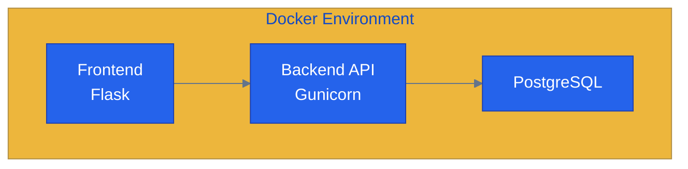

# 🐳 Docker: Zero to Production

   

A hands-on Docker learning repository that takes a small Flask application from a single container to a production-ready multi-service stack.

The focus is not just running Docker commands, but understanding:

- how containers actually behave
- how networking and persistence work
- why deployments fail
- how production systems are debugged

---

## Architecture

A three-service application running with Docker and Docker Compose:

The stack evolves gradually across 28 steps:

- Single containers
- Docker Compose
- Networking
- Persistence
- Production hardening
- CI/CD
- Real-world troubleshooting

---

##  What This Repository Covers

| Area | Topics |
|---|---|
| Foundations | Images, containers, Dockerfiles, lifecycle |
| Networking | Port mapping, DNS, service discovery |
| Storage | Volumes, bind mounts, PostgreSQL persistence |
| Production | Health checks, restart policies, resource limits |
| Security | Non-root users, capabilities, vulnerability scanning |
| CI/CD | Registries, version tagging, GitHub Actions |
| Troubleshooting | Incident response, debugging, interview preparation |

---

## Repository Structure

| Steps | Focus Area |
|---|---|
| 01–06 | Foundations |
| 07–13 | Multi-container applications |
| 14–22 | Production readiness |
| 23–25 | Deployment and CI/CD |
| 26–28 | Troubleshooting and production scenarios |

---

## Who This Repository Is For

- Beginners starting with Docker
- Backend engineers
- Cloud / DevOps engineers
- Anyone who wants to understand Docker beyond basic tutorials

---

## Why I Built This Repository

This repository started as my own effort to learn Docker properly as a cloud engineer. Not just how to use it, but how it behaves in real environments.

Most sections are written around the kinds of questions I personally had while learning:
why builds behave differently, why networking fails, what persists, what breaks, and how production systems are debugged.

The repository is designed to be followed step-by-step, from basic containers to production troubleshooting and deployment workflows.